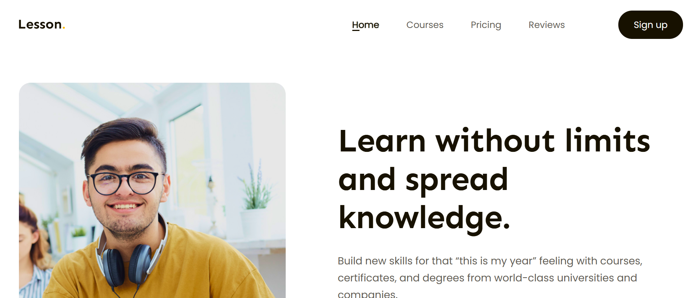

# 📚 The Lesson Landing Page

This is a personal website built with HTML, CSS, JavaScript showcasing my Frontend skills and documenting my amazing projects on my journey to becoming a Frontend Developer.
# My Website on computer:
  
## 🎯 Goal: 
- Demonstrate my **HTML/CSS**, **JavaScript** skills through a beautiful and smooth interface.

## ✨ Key Features:
- 📱 **Interface**: Looks great on desktop
## 🛠 Technologies Used
-  **HTML/CSS**, **JavaScript**
## 📖 Installation
1. **Clone the repository**:
   ```bash
   git clone https://github.com/vannhac/The-Lesson-Website.git
   ```
2. **Navigate to the project folder**:
   ```bash
   cd The-Lesson-Website
   ```
3. **Open the CV**:
   - Open `index.html` in a browser to view the website
   - Alternatively, deploy to GitHub Pages or a web server.

---
